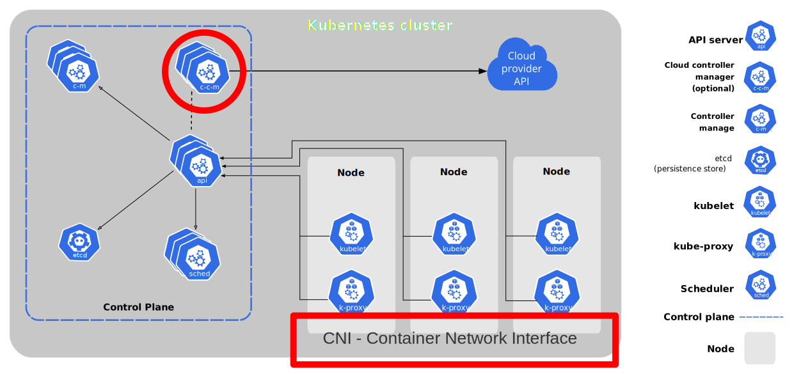

# The Differences between Managed Kubernetes on AWS, Azure and GCP

```sh
$ whoami
Benas Taurosevičius
Platform Engineer @ Mambu
```


DevOps in Shorts 2023

---

## Kubernetes?

* Kubernetes is an open-source container orchestration platform
* Automates the deployment, scaling, and management of applications
* Strated as `borg` at Google, now maintained by CNCF
* Declarative configuration and included features like: automated scaling, load balancing, rolling updates, and self-healing
* Kubernetes can run on a variety of platforms, including **public** and private clouds, on-premises data centers, and even on your local development machine.

---

## Why is Kubernetes important in the context of DevOps?

* Automation
* Standardization and Community
* Scalability
* Resilience
* **Portability**

<!--
Automation: Kubernetes automates many of the tasks involved in managing containerized applications, including deployment, scaling, and self-healing. This reduces the amount of manual effort required, allowing DevOps teams to focus on other tasks.

Standardization: Kubernetes provides a standardized way to manage containers, making it easier for DevOps teams to collaborate and share code across different projects and environments.

Scalability: Kubernetes makes it easy to scale applications up or down as needed, allowing DevOps teams to respond quickly to changes in demand.

Resilience: Kubernetes includes built-in features for ensuring the availability and reliability of containerized applications, including automated failover and self-healing.

Portability: Kubernetes can run on a variety of platforms, including public and private clouds, on-premises data centers, and even on your local development machine. This makes it easy to move applications between environments, reducing vendor lock-in and giving DevOps teams more flexibility.
-->

---
## Kubernetes architecture


---

## Managed Kubernetes

>  is a service provided by cloud providers, such as AWS, Azure, and GCP, that allows you to run Kubernetes clusters without having to manage the underlying infrastructure. Essentially, it's a turnkey solution for running Kubernetes that allows you to focus on deploying and managing your applications, rather than worrying about the infrastructure.

\- ChatGPT


<!--
Managed Kubernetes typically provides features such as automatic upgrades, automated scaling, monitoring, and backup and recovery. This reduces the operational overhead of running Kubernetes and makes it easier for DevOps teams to deploy and manage applications at scale.

Managed Kubernetes services may differ in terms of their pricing models, supported features, and ease of use. However, in general, they provide a simplified way to run Kubernetes that allows DevOps teams to focus on delivering value to their customers, rather than managing infrastructure.
-->
---

## AWS Managed Kubernetes

- Called AWS EKS - Elastic Kubernetes Service
- Successor to the ECS - Elastic Container Service
- Preview in 2017, launched in 2018
- Provides a `serverless` capability EKS Fargate
- Provides tools to integrate with on premises with `EKS Anywhere`, `EKS on AWS Outposts`, `EKS Anywhere on Snowball Edge,` etc.
---

## Azure Managed Kubernetes

- Called Azure Kubernetes Service
- Preview in 2017, launched in 2018
- Provides on-premises deployment on `Azure Stack HCI`
- Able to run serverless with integration with `Azure Container Instances`

---

## GCP Managed Kubernetes

- Google Kubernetes Engine
- 2014: Google open-sourced Kubernetes
- 2016: GKE became generally available in February 2016, beta was available since 2015
- 2018: GKE On-Prem
- 2020: GKE Autopilot 

---
## Differences



<!--
## What do they have in common

- Managed Control Plane:
  - api-server
  - etcd
  - schedulers
  - controller managers
- Ability to add/remove/update/scale nodes
- ...
-->
---
## Networking on `AWS`
* not provided by default
* AWS VPC CNI can be installed via 2 clicks, cli command or as a terraform resource
  * does not enforce Network Policies
* any other CNI can be used, but AWS refuses to provide support for such clusters

---
## Networking on `Azure`
* `kubenet` - simple NAT, does not support Windows nodes
* `Azure CNI` - each pod gets a reachable IP in subnet
* `Bring your own CNI` - since last year, Microsoft will not provide support

---
## Networking on `GCP`
* `Dataplane v1` - based on Calico
* `Dataplane v2` - based on Cilium, leverages eBPF instead of `iptables`, default for new GKE and Autopilot clusters
* Does not allow to bring your own CNI, configuration is pretty limited, but very robust

---
## Node management

- AWS
  * Supports Self-Managed nodes, or Managed Node Pools
- Azure
  * Has 2 types of NodePools - `system` and `user`
  * Does not allow Strict Zone Balancing when creating a Node Pool, even though the underlying VMSS allows it
- GCP
  * Node Pool creates Instance Groups based on number of AZs
  * Each Instance Group can be scaled independently
---
## Cluster Autoscaler

| Cloud | Cluster Autoscaler |
| ----- | ------------------ |
| AWS   | Not provided, bring-ypur-own model |
| Azure | Provided, enabled by default, [can be configured, 20 parameters](https://learn.microsoft.com/en-us/azure/aks/cluster-autoscaler#using-the-autoscaler-profile) |
| GCP   | Provided, disabled by default [can be configured, 4 parameters](https://cloud.google.com/kubernetes-engine/docs/how-to/cluster-autoscaler)                    |


---

## Conclusion

- All are very simmilar.
- All have many caveats.
- Is one better then another?
</br>
</br>

## Thank you!

#### Time for questions

---

# The Differences between Managed Kubernetes on AWS, Azure and GCP

```sh
$ whoami
Benas Taurosevičius
Platform Engineer @ Mambu
```


DevOps in Shorts 2023
